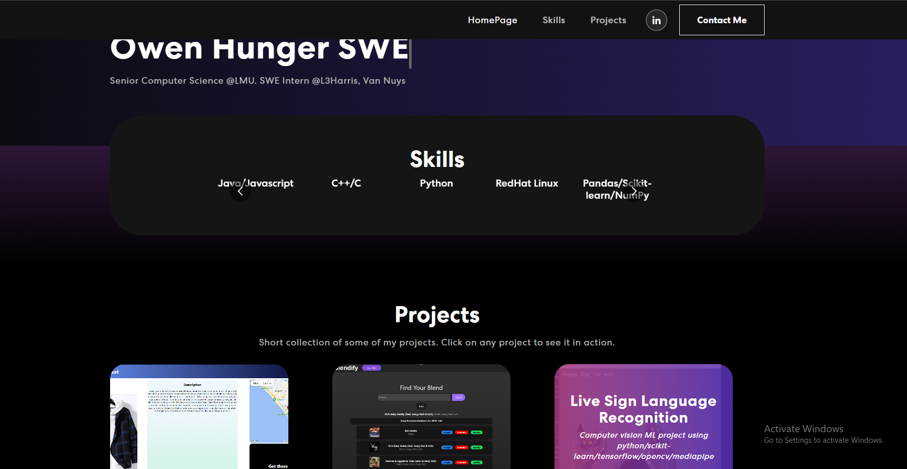

# Personal Portfolio Website

 <!-- Replace `path/to/your/image.jpg` with the actual path to your image -->

This repository contains the source code for my personal portfolio website, built using React. This website showcases my projects, skills, and provides a way for visitors to contact me. The application features various components, including an intro section, project section, navigation bar, skills section, and a contact me section that allows users to send emails directly to me.

## Table of Contents

- [Features](#features)
- [Installation](#installation)
- [Usage](#usage)
- [Project Structure](#project-structure)
- [Technologies Used](#technologies-used)

## Features

**1. Intro Section**
   - Provides a brief introduction about me.
   - Showcases my personal and professional background.
   - Utilized a lot of new css libraries that I thought were cool, kind of wasted alot of time here if I am being honest, learned how to animate stuff. I feel like I got a lot stronger at frontend during this project though.

**2. Project Section**
   - SKELETON CODE, IT WORKS, but haven't uploaded my projects yet. advanced css here
   - Displays a collection of my projects.
   - Each project includes a title, description, and a link to the project repository or live demo.

**3. Navigation Bar**
   - Allows easy navigation between different sections of the portfolio website.
   - Provides a user-friendly interface for visitors.

**4. Skills Section**
   - Highlights my technical skills and expertise.
   - Provides a quick overview of the technologies I am proficient in.

**5. Contact Me Section**
   - Features a contact form for users to send messages directly to my email.
   - Validates user inputs and sends an email with the entered details.

## Installation

Install dependencies:
  npm install
Start the development server:
  npm start

## Usage
  Customize the content of each section by updating component in the src/components directory. Modify the styling by editing the styles in the src/styles directory.

## Project Structure
  The project structure follows a standard React application layout:

public/: Contains static assets and the HTML template.
src/: Contains the React application source code.
components/: Includes individual React components for different sections.
index.js: Entry point of the React application.

## Technologies Used
React
HTML5
CSS

